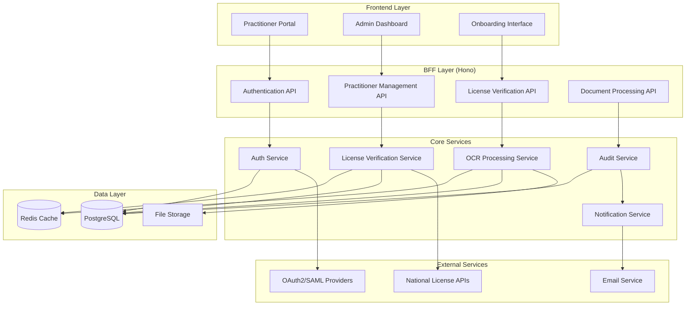

# Design Document

## Overview

The Practitioner Management system provides a secure, auditable workflow for verifying healthcare practitioner credentials and managing system access. The system integrates with national/international licensing databases, performs OCR verification of uploaded certificates, and enforces role-based access control (RBAC) with comprehensive audit logging.

The design follows a microservices architecture pattern with clear separation of concerns: authentication services, license verification services, document processing services, and audit logging services. This modular approach ensures scalability, maintainability, and compliance with healthcare regulations.

## Architecture

### High-Level Architecture



### Service Architecture

The system is built using a Backend for Frontend (BFF) pattern with Hono.js providing lightweight API routing and data aggregation. Core services are designed as independent modules that can be scaled horizontally.

**Authentication Flow:**

1. OAuth2 for standard practitioner authentication
2. SAML integration for enterprise SSO
3. JWT tokens for session management
4. Role-based middleware for API protection

**License Verification Flow:**

1. Real-time API calls to national databases
2. Fallback to manual verification queue
3. OCR processing for certificate validation
4. Cross-reference validation between API and OCR data

## Components and Interfaces

### 1. Authentication Service

**Purpose:** Handles user authentication, session management, and OAuth2/SAML integration.

**Key Methods:**

```typescript
interface AuthService {
	authenticateUser(credentials: LoginCredentials): Promise<AuthResult>
	validateSession(token: string): Promise<UserSession>
	refreshToken(refreshToken: string): Promise<TokenPair>
	revokeSession(sessionId: string): Promise<void>
	initiateSAMLAuth(organizationId: string): Promise<SAMLRedirectURL>
	handleSAMLCallback(samlResponse: string): Promise<AuthResult>
}

interface LoginCredentials {
	email: string
	password?: string
	organizationId?: string
	authMethod: 'oauth2' | 'saml'
}

interface AuthResult {
	success: boolean
	user?: UserProfile
	tokens?: TokenPair
	redirectUrl?: string
	error?: string
}
```

**Dependencies:**

- OAuth2 providers (Google, Microsoft, etc.)
- SAML identity providers
- JWT token management
- Session storage (Redis)

### 2. License Verification Service

**Purpose:** Validates practitioner licenses against official databases and manages verification status.

**Key Methods:**

```typescript
interface LicenseVerificationService {
	verifyLicense(licenseData: LicenseInfo): Promise<VerificationResult>
	checkLicenseStatus(licenseNumber: string, jurisdiction: string): Promise<LicenseStatus>
	queueManualVerification(practitionerId: string, reason: string): Promise<void>
	updateVerificationStatus(practitionerId: string, status: VerificationStatus): Promise<void>
	getVerificationHistory(practitionerId: string): Promise<VerificationHistory[]>
}

interface LicenseInfo {
	licenseNumber: string
	jurisdiction: string
	practitionerName: string
	licenseType: string
	expiryDate?: Date
}

interface VerificationResult {
	status: 'verified' | 'failed' | 'pending' | 'manual_review'
	details: {
		apiResponse?: any
		matchScore?: number
		discrepancies?: string[]
	}
	timestamp: Date
}
```

**External API Integrations:**

- US: National Provider Identifier (NPI) Registry
- UK: General Medical Council (GMC) Register
- Canada: College of Physicians and Surgeons databases
- EU: National medical board APIs
- Fallback manual verification workflow

### 3. OCR Processing Service

**Purpose:** Extracts text from uploaded license certificates and validates against entered information.

**Key Methods:**

```typescript
interface OCRService {
	processDocument(fileBuffer: Buffer, fileType: string): Promise<OCRResult>
	extractLicenseData(ocrText: string): Promise<ExtractedLicenseData>
	validateAgainstInput(
		extracted: ExtractedLicenseData,
		input: LicenseInfo
	): Promise<ValidationResult>
	getProcessingStatus(jobId: string): Promise<ProcessingStatus>
}

interface OCRResult {
	success: boolean
	extractedText: string
	confidence: number
	processingTime: number
	error?: string
}

interface ExtractedLicenseData {
	licenseNumber?: string
	practitionerName?: string
	expiryDate?: Date
	issuingAuthority?: string
	confidence: {
		licenseNumber: number
		name: number
		date: number
	}
}
```

**Technology Stack:**

- WebAssembly-based OCR engine for client-side processing
- Tesseract.js for text extraction
- Custom ML models for medical license document recognition
- PDF parsing libraries for structured data extraction

### 4. Audit Service

**Purpose:** Maintains immutable audit logs for all system activities and compliance reporting.

**Key Methods:**

```typescript
interface AuditService {
	logEvent(event: AuditEvent): Promise<void>
	queryAuditLog(filters: AuditFilters): Promise<AuditEntry[]>
	generateComplianceReport(dateRange: DateRange, type: ReportType): Promise<ComplianceReport>
	exportAuditData(filters: AuditFilters, format: 'json' | 'csv'): Promise<Buffer>
}

interface AuditEvent {
	eventType: string
	userId?: string
	practitionerId?: string
	action: string
	details: Record<string, any>
	ipAddress: string
	userAgent: string
	timestamp: Date
}

interface AuditFilters {
	dateRange?: DateRange
	eventTypes?: string[]
	userIds?: string[]
	actions?: string[]
	limit?: number
	offset?: number
}
```

### 5. Role-Based Access Control (RBAC) Service

**Purpose:** Manages user roles, permissions, and access control throughout the system.

**Key Methods:**

```typescript
interface RBACService {
	assignRole(userId: string, role: UserRole): Promise<void>
	checkPermission(userId: string, resource: string, action: string): Promise<boolean>
	getUserPermissions(userId: string): Promise<Permission[]>
	updateRolePermissions(role: UserRole, permissions: Permission[]): Promise<void>
	getResourceAccess(userId: string, resourceType: string): Promise<ResourceAccess[]>
}

enum UserRole {
	OWNER = 'owner',
	PRACTITIONER = 'practitioner',
	ASSISTANT = 'assistant',
}

interface Permission {
	resource: string
	actions: string[]
	conditions?: Record<string, any>
}
```

## Data Models

### Core Entities

```typescript
// User and Practitioner Models
interface User {
	id: string
	email: string
	firstName: string
	lastName: string
	role: UserRole
	organizationId: string
	isActive: boolean
	lastLoginAt?: Date
	createdAt: Date
	updatedAt: Date
}

interface Practitioner extends User {
	licenseNumber: string
	jurisdiction: string
	licenseType: string
	licenseExpiryDate?: Date
	verificationStatus: VerificationStatus
	verifiedAt?: Date
	verifiedBy?: string
	specialties: string[]
	credentials: string[]
}

enum VerificationStatus {
	PENDING = 'pending',
	VERIFIED = 'verified',
	FAILED = 'failed',
	MANUAL_REVIEW = 'manual_review',
	EXPIRED = 'expired',
}

// Document and Verification Models
interface LicenseCertificate {
	id: string
	practitionerId: string
	fileName: string
	fileSize: number
	mimeType: string
	uploadedAt: Date
	ocrStatus: OCRStatus
	ocrResult?: OCRResult
	verificationStatus: DocumentVerificationStatus
}

enum OCRStatus {
	PENDING = 'pending',
	PROCESSING = 'processing',
	COMPLETED = 'completed',
	FAILED = 'failed',
}

// Audit and Compliance Models
interface AuditEntry {
	id: string
	eventType: string
	userId?: string
	practitionerId?: string
	action: string
	details: Record<string, any>
	ipAddress: string
	userAgent: string
	timestamp: Date
	hash: string // For immutability verification
}

interface VerificationAttempt {
	id: string
	practitionerId: string
	attemptType: 'api' | 'ocr' | 'manual'
	status: VerificationStatus
	apiProvider?: string
	apiResponse?: Record<string, any>
	ocrConfidence?: number
	reviewedBy?: string
	notes?: string
	createdAt: Date
}
```

### Database Schema Design

**PostgreSQL Tables:**

```sql
-- Users and Practitioners
CREATE TABLE users (
  id UUID PRIMARY KEY DEFAULT gen_random_uuid(),
  email VARCHAR(255) UNIQUE NOT NULL,
  first_name VARCHAR(100) NOT NULL,
  last_name VARCHAR(100) NOT NULL,
  role VARCHAR(20) NOT NULL CHECK (role IN ('owner', 'practitioner', 'assistant')),
  organization_id UUID NOT NULL,
  is_active BOOLEAN DEFAULT true,
  last_login_at TIMESTAMP WITH TIME ZONE,
  created_at TIMESTAMP WITH TIME ZONE DEFAULT NOW(),
  updated_at TIMESTAMP WITH TIME ZONE DEFAULT NOW()
);

CREATE TABLE practitioners (
  id UUID PRIMARY KEY REFERENCES users(id),
  license_number VARCHAR(100) NOT NULL,
  jurisdiction VARCHAR(100) NOT NULL,
  license_type VARCHAR(100) NOT NULL,
  license_expiry_date DATE,
  verification_status VARCHAR(20) NOT NULL DEFAULT 'pending',
  verified_at TIMESTAMP WITH TIME ZONE,
  verified_by UUID REFERENCES users(id),
  specialties TEXT[],
  credentials TEXT[],
  UNIQUE(license_number, jurisdiction)
);

-- Document Management
CREATE TABLE license_certificates (
  id UUID PRIMARY KEY DEFAULT gen_random_uuid(),
  practitioner_id UUID NOT NULL REFERENCES practitioners(id),
  file_name VARCHAR(255) NOT NULL,
  file_size INTEGER NOT NULL,
  mime_type VARCHAR(100) NOT NULL,
  file_path VARCHAR(500) NOT NULL,
  uploaded_at TIMESTAMP WITH TIME ZONE DEFAULT NOW(),
  ocr_status VARCHAR(20) DEFAULT 'pending',
  ocr_result JSONB,
  verification_status VARCHAR(20) DEFAULT 'pending'
);

-- Audit and Compliance
CREATE TABLE audit_entries (
  id UUID PRIMARY KEY DEFAULT gen_random_uuid(),
  event_type VARCHAR(100) NOT NULL,
  user_id UUID REFERENCES users(id),
  practitioner_id UUID REFERENCES practitioners(id),
  action VARCHAR(100) NOT NULL,
  details JSONB NOT NULL,
  ip_address INET NOT NULL,
  user_agent TEXT,
  timestamp TIMESTAMP WITH TIME ZONE DEFAULT NOW(),
  hash VARCHAR(64) NOT NULL -- SHA-256 hash for immutability
);

-- Verification History
CREATE TABLE verification_attempts (
  id UUID PRIMARY KEY DEFAULT gen_random_uuid(),
  practitioner_id UUID NOT NULL REFERENCES practitioners(id),
  attempt_type VARCHAR(20) NOT NULL CHECK (attempt_type IN ('api', 'ocr', 'manual')),
  status VARCHAR(20) NOT NULL,
  api_provider VARCHAR(100),
  api_response JSONB,
  ocr_confidence DECIMAL(5,4),
  reviewed_by UUID REFERENCES users(id),
  notes TEXT,
  created_at TIMESTAMP WITH TIME ZONE DEFAULT NOW()
);
```

## Error Handling

### Error Classification

**1. Authentication Errors**

- Invalid credentials
- Expired sessions
- OAuth2/SAML provider failures
- Rate limiting violations

**2. License Verification Errors**

- API unavailability
- Invalid license numbers
- Jurisdiction not supported
- Data format mismatches

**3. Document Processing Errors**

- File upload failures
- OCR processing errors
- Unsupported file formats
- File size limitations

**4. System Errors**

- Database connectivity issues
- External service timeouts
- Resource exhaustion
- Configuration errors

### Error Handling Strategy

```typescript
interface ErrorResponse {
	error: {
		code: string
		message: string
		details?: Record<string, any>
		timestamp: Date
		requestId: string
	}
}

class PractitionerManagementError extends Error {
	constructor(
		public code: string,
		message: string,
		public statusCode: number = 500,
		public details?: Record<string, any>
	) {
		super(message)
		this.name = 'PractitionerManagementError'
	}
}

// Error handling middleware
const errorHandler = (error: Error, req: Request, res: Response, next: NextFunction) => {
	const requestId = req.headers['x-request-id'] as string

	if (error instanceof PractitionerManagementError) {
		auditService.logEvent({
			eventType: 'error',
			action: 'api_error',
			details: { error: error.code, message: error.message },
			ipAddress: req.ip,
			userAgent: req.get('User-Agent'),
			timestamp: new Date(),
		})

		return res.status(error.statusCode).json({
			error: {
				code: error.code,
				message: error.message,
				details: error.details,
				timestamp: new Date(),
				requestId,
			},
		})
	}

	// Handle unexpected errors
	logger.error('Unexpected error:', error)
	return res.status(500).json({
		error: {
			code: 'INTERNAL_ERROR',
			message: 'An unexpected error occurred',
			timestamp: new Date(),
			requestId,
		},
	})
}
```

### Retry and Fallback Mechanisms

**License Verification Fallbacks:**

1. Primary API call with 3-second timeout
2. Retry with exponential backoff (max 3 attempts)
3. Try alternative API provider if available
4. Queue for manual verification if all APIs fail

**OCR Processing Fallbacks:**

1. Client-side WebAssembly OCR
2. Server-side Tesseract processing
3. Cloud OCR service (Google Vision API)
4. Manual document review queue

## Testing Strategy

### Unit Testing

- Service layer methods with mocked dependencies
- Data validation and transformation functions
- Error handling scenarios
- RBAC permission checking logic

### Integration Testing

- API endpoint testing with real database
- External service integration (mocked responses)
- Authentication flow testing
- File upload and processing workflows

### End-to-End Testing

- Complete practitioner onboarding workflow
- License verification with various scenarios
- Role-based access control validation
- Audit log generation and querying

### Security Testing

- Authentication bypass attempts
- Authorization escalation testing
- Input validation and sanitization
- SQL injection and XSS prevention
- Rate limiting effectiveness

### Performance Testing

- Concurrent user load testing
- Database query optimization
- File upload performance
- OCR processing throughput
- API response time validation

## Security Considerations

### Data Protection

- AES-256 encryption for sensitive data at rest
- TLS 1.3 for all data in transit
- Field-level encryption for PII
- Secure key management with rotation

### Access Control

- Multi-factor authentication for admin users
- Session timeout and automatic logout
- IP-based access restrictions
- Device fingerprinting for suspicious activity detection

### Audit and Compliance

- Immutable audit logs with cryptographic hashing
- HIPAA-compliant data handling procedures
- GDPR compliance with data portability and deletion
- Regular security assessments and penetration testing

### Input Validation

- Strict input sanitization and validation
- File type and size restrictions
- Rate limiting on all API endpoints
- CSRF protection for state-changing operations

This design provides a robust, scalable, and secure foundation for the Practitioner Management feature while maintaining compliance with healthcare regulations and industry best practices.
